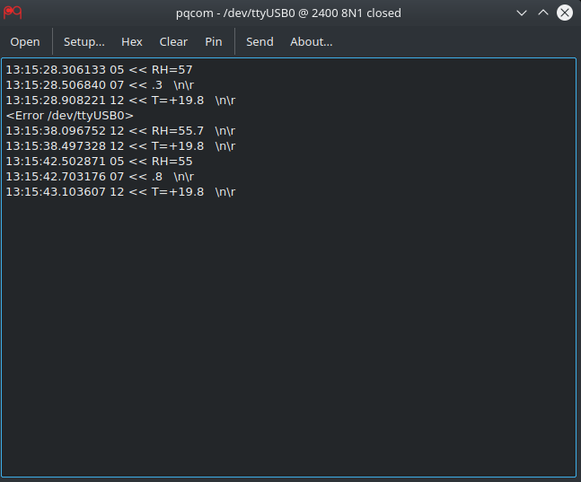

===========================================

**A simple serial port tool for Linux/Windows/Mac.**
It's written by Python 3 and Qt (PyQt5).

## Fork changes

### Com port reopen

This fork includes `Reopen` checkbox to automatic reopen a missing serial port when it come back in the system.

### USB UID::PID autoconnect filter

And `USB VID:PID` filter to connect a port.

### Examples of reopen and USB autoconnect filter




### Comman-line interface

Fork also includes command-line interface:

```sh
usage: main.py [-h] [-p COM_PORT] [-b BAUDRATE] [--port-parameters PARAMETERS]
               [-r] [-s] [-x] [--vid-pid VID:PID]

Simple serial port dump

optional arguments:
  -h, --help            show this help message and exit
  -p COM_PORT, --port COM_PORT
                        serial port
  -b BAUDRATE, --baudrate BAUDRATE
                        serial port baudrate; default: 115200
  --port-parameters PARAMETERS
                        serial port parameters; default: 8N1
  -r                    reconnect to serial port
  -s                    start and hide setup dialog
  -x                    switch to HEX view
  --vid-pid VID:PID     search for USB: VendorID:ProductID[,VendorID:ProductID[...]]; example: 03eb:2404,03eb:6124
```

## Examples

Usage example of USB temperature & hudminity sensor:

```sh
python main.py --vid-pid 1a86:7523 -rsb 2400
```


## Python 3 packets requirements

-	argparse
-	pyserial
-	pyqt5

To install python packages can be used pip3. PyQt5 can be installed by [Anaconda](https://docs.continuum.io/anaconda/pkg-docs).

### Windows

```sh
pip3 install argparse pyserial pyqt5
```

## Linux

```sh
pip3 install argparse pyserial
```

On Linux based systems should be used packet manager instead of python pip for PyQt5 installation.
