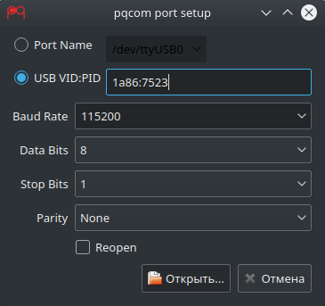

===========================================

A simple serial port tool for Linux/Windows/Mac. It's written by Python and Qt (PyQt5).

This fork includes `Reopen` checkbox to automatic reopen a missing serial port when it come back in the system. This can be useful in developing the electronic devices.

### Requirements

-	python
-	pyserial
-	pyqt5